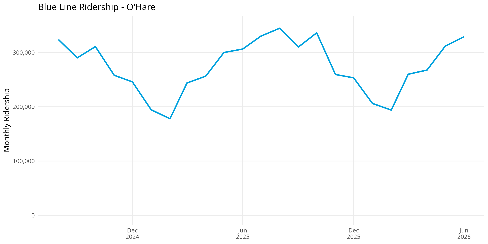
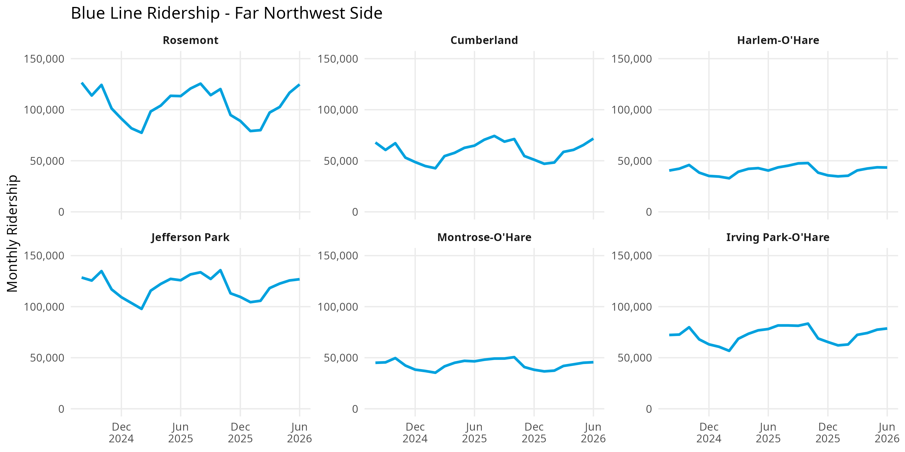
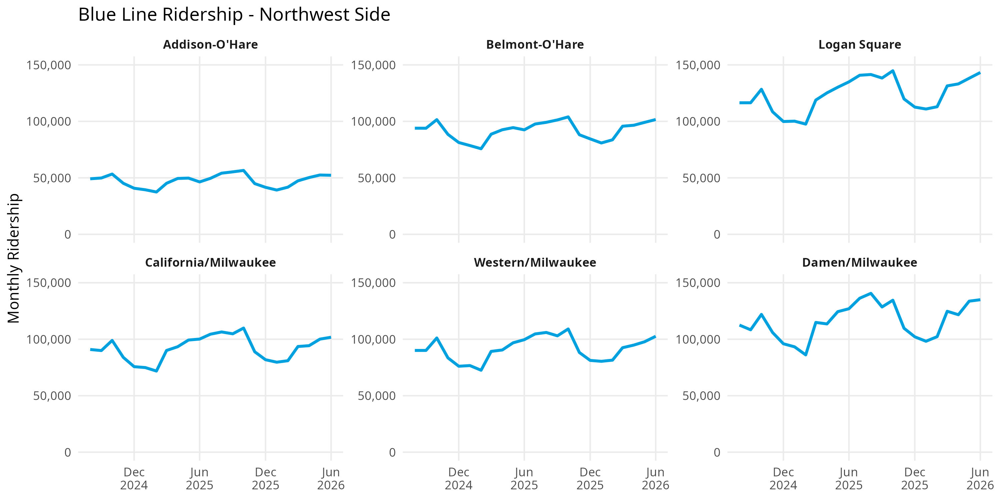
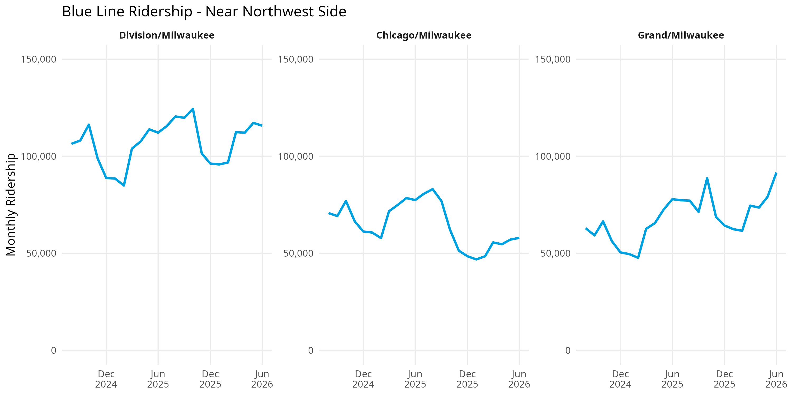
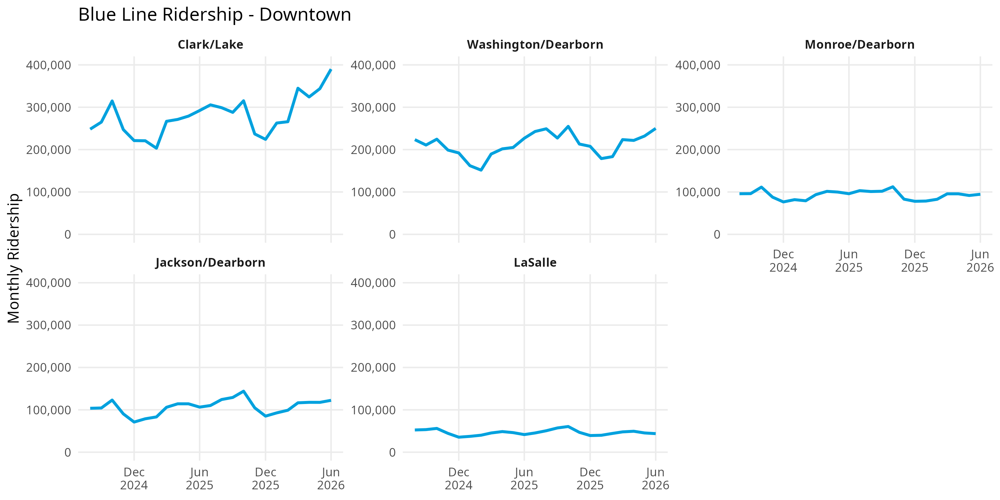
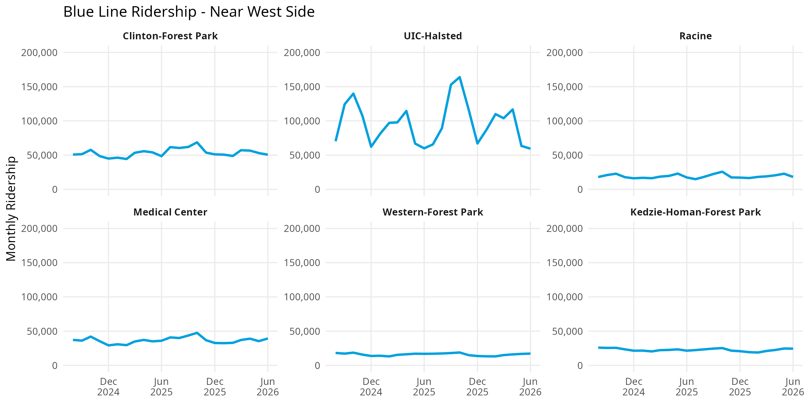
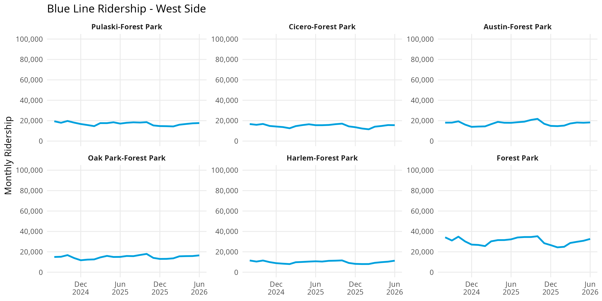

## Introduction

The CTA Blue Line is one of Chicago's major rail lines, connecting O'Hare International Airport and the Northwest Side to Downtown Chicago before continuing west through the Near West Side, West Side, and into the western suburbs.

This analysis examines monthly station ridership across the Blue Line to identify differences in ridership patterns between stations and different parts of the route.

Rather than examining the Blue Line as a single system, stations are grouped geographically to better understand how ridership varies across different sections of the line.

The analysis uses monthly CTA station-entry data.

---

## O'Hare

O'Hare is analyzed separately from the other Far Northwest Side stations because of its unique role as an airport station.

### Key Findings

- **O'Hare Airport:** O'Hare has some of the highest ridership on the Blue Line and shows a strong seasonal pattern. Ridership falls substantially during the winter and rebounds during the spring and summer. Unlike a typical neighborhood station, O'Hare directly connects the CTA system with O'Hare International Airport and the Airport Transit System. Its ridership therefore includes airport passengers and employees in addition to other CTA riders. Seasonal changes in air travel may contribute to the pattern seen in the graph, although station-level data alone cannot establish causation.

## Far Northwest Side

The Far Northwest Side follows the O'Hare branch from Rosemont through Irving Park.

### Key Findings

- **Rosemont:** Rosemont has some of the highest ridership in this section. The station serves as a major suburban connection point, with a Park & Ride facility and connections to numerous Pace bus routes. This allows the station to draw riders from a much larger area than its immediate surroundings. Its proximity to O'Hare and the hotels, employment, and entertainment destinations in Rosemont may also contribute to demand.

- **Cumberland:** Cumberland also maintains relatively high ridership and functions as another gateway between suburban transportation and the Blue Line. The station has parking and connections to CTA, Pace, and intercity bus service. Its ridership therefore may include commuters who reach the station by bus or car rather than only residents within walking distance.

- **Harlem-O'Hare:** Harlem has substantially lower ridership than Rosemont and Cumberland despite also offering parking and connections to CTA and Pace buses. This suggests that simply providing connecting services does not automatically produce high ridership; the number and type of connections, surrounding destinations, and location may also matter.

- **Jefferson Park:** Jefferson Park is one of the strongest examples of a multimodal transportation hub on the Blue Line. Riders can transfer between the Blue Line, Metra's Union Pacific Northwest Line, Pace Pulse, several Pace routes, and numerous CTA bus routes. Its relatively high ridership may therefore reflect a much larger service area than the Jefferson Park neighborhood itself.

- **Montrose-O'Hare:** Montrose has comparatively low ridership despite having access to the nearby Mayfair Metra station and the #78 Montrose bus. This provides an interesting contrast with Jefferson Park and suggests that the presence of a Metra connection alone does not necessarily generate high CTA station ridership.

- **Irving Park-O'Hare:** Irving Park has stronger ridership than several nearby stations and is located near the Irving Park Metra station on the Union Pacific Northwest Line. It also connects with multiple CTA bus routes. These connections may allow the station to attract riders from a wider area than stations with fewer transportation options.

## Northwest Side

This section follows the Milwaukee Avenue corridor from Addison through Damen.

### Key Findings

- **Addison-O'Hare:** Addison has the lowest ridership among the stations in this group. It connects with the #152 Addison bus but does not function as a major rail or regional transportation hub. This also distinguishes it from the Red Line Addison station, which directly serves Wrigley Field and experiences substantial baseball-season ridership.

- **Belmont-O'Hare:** Belmont maintains moderate ridership and connects with the #77 Belmont and #82 Kimball/Homan buses. Its location between the Kennedy Expressway and surrounding residential neighborhoods gives it a different station environment from the Milwaukee Avenue stations farther southeast.

- **Logan Square:** Logan Square is one of the busiest neighborhood stations in this section. Although it does not connect with another rail system, it connects with several CTA bus routes and sits within a dense residential and commercial area. Its relatively high ridership demonstrates that a station does not need to be a major rail-transfer hub to generate substantial demand.

- **California/Milwaukee:** California has lower ridership than Logan Square but benefits from connections to the #56 Milwaukee and #94 California buses. Its proximity to other Blue Line stations along Milwaukee Avenue may also distribute riders among several nearby stations.

- **Western/Milwaukee:** Western maintains relatively strong ridership and has particularly extensive bus connectivity, including Western Avenue and Milwaukee Avenue service. These connections allow passengers traveling north or south to transfer to the east-west Blue Line corridor.

- **Damen/Milwaukee:** Damen is one of the highest-ridership stations in this section despite not connecting with another rail line. Its location in the Wicker Park commercial district places it near dense housing, restaurants, retail, nightlife, and other destinations, while several CTA bus routes provide additional connections. Its ridership likely reflects a mixture of commuting and non-work travel.

## Near Northwest Side

The Near Northwest Side group includes Division, Chicago, and Grand.

### Key Findings

- **Division/Milwaukee:** Division consistently has the highest ridership of the three stations in this group. It sits at the intersection of Division, Milwaukee, and Ashland and connects with several major CTA bus routes. Its location within a dense residential and commercial area may help explain why it consistently attracts more riders than Chicago and Grand.

- **Chicago/Milwaukee:** Chicago shows a noticeable decline during the later portion of the period before beginning to recover. The station connects with the #56 Milwaukee and #66 Chicago buses, but its graph differs considerably from nearby Division. The available connection information does not provide an obvious explanation for the decline, making this a pattern that would require additional research.

- **Grand/Milwaukee:** Grand shows substantial growth toward the end of the period analyzed. The station connects with bus service along Grand, Halsted, and Milwaukee. Its increase is especially interesting when compared with Chicago because the two stations are geographically close but follow different ridership trends. This suggests that ridership changes can be highly localized rather than occurring uniformly along a section of the Blue Line.

## Downtown

The Downtown section follows the Dearborn subway from Clark/Lake through LaSalle.

### Key Findings

- **Clark/Lake:** Clark/Lake is by far the busiest station in this section and rises particularly sharply during 2026. It is also the Blue Line's most significant rail-transfer hub: passengers can connect with the Brown, Green, Orange, Pink, and Purple lines. Its high ridership therefore reflects its role within the broader CTA network rather than simply demand generated by the surrounding blocks.

- **Washington/Dearborn:** Washington maintains some of the highest ridership among the Downtown stations. In addition to its central Loop location, passengers can connect with the Red Line at Lake through the pedestrian connection. The station is also served by numerous bus routes. Its combination of Downtown destinations and transit connections likely contributes to its high usage.

- **Monroe/Dearborn:** Monroe has moderate ridership compared with Washington and Clark/Lake. Although numerous bus routes operate nearby, it does not provide the same direct rail-transfer opportunities as Clark/Lake. This provides another example of how ridership can vary substantially even among stations located only a few blocks apart.

- **Jackson/Dearborn:** Jackson functions as another important Downtown transfer point. Passengers can connect with the Red Line at Jackson and reach the elevated Brown, Orange, Pink, and Purple lines through the nearby Harold Washington Library station. These connections may contribute to its relatively strong ridership.

- **LaSalle:** LaSalle has the lowest ridership among the Downtown stations analyzed despite its location in the Loop. The station provides access to the nearby LaSalle Street Station and Metra's Rock Island District, but its ridership remains substantially below Clark/Lake and Washington. This demonstrates that simply being located Downtown or near another rail service does not guarantee high CTA station entries.

## Near West Side

The Near West Side section follows the Forest Park branch from Clinton through Kedzie-Homan.

### Key Findings

- **Clinton-Forest Park:** Clinton serves an important transportation area near Chicago Union Station. Union Station provides access to several Metra lines and Amtrak intercity and long-distance trains, while the surrounding area is also served by multiple CTA bus routes. Clinton can therefore function as a connection between the Blue Line and Chicago's regional and national rail network. However, its ridership remains considerably below the busiest Downtown Blue Line stations.

- **UIC-Halsted:** UIC-Halsted shows the most dramatic fluctuations in this section. Ridership rises sharply during some portions of the year and falls during others. Because the station directly serves the University of Illinois Chicago, the academic calendar may contribute to this pattern. Its connections with several CTA bus routes further expand the area from which riders can reach the station.

- **Racine:** Racine has considerably lower ridership than neighboring UIC-Halsted. Although the two stations share several east-west bus connections, Racine does not directly serve a destination comparable in scale to UIC. This contrast demonstrates how a major institution can potentially affect ridership at one station without producing the same demand at the next station.

- **Illinois Medical District:** Illinois Medical District maintains comparatively consistent ridership. The station directly serves one of the country's largest concentrations of hospitals and medical institutions, creating travel demand from employees, patients, students, and visitors throughout the year. This may help explain why its ridership pattern is less seasonal than UIC-Halsted.

- **Western-Forest Park:** Western has relatively low ridership despite connections with Western Avenue and Harrison bus service. Its totals begin to show the broader pattern seen farther west on the Forest Park branch, where station entries are substantially lower than Downtown and much of the O'Hare branch.

- **Kedzie-Homan:** Kedzie-Homan also records relatively low ridership despite connections with several CTA bus routes. Together with Western, its graph marks the beginning of a sustained stretch of lower-ridership stations along the western portion of the Forest Park branch.

## West Side

The West Side section follows the Forest Park branch from Pulaski to Forest Park.

### Key Findings

- **Pulaski:** Pulaski records relatively low but generally stable ridership. It connects with Harrison and Pulaski bus service but does not function as a major regional transportation hub.

- **Cicero:** Cicero also has relatively low ridership, although it has more connecting services than several neighboring stations. In addition to CTA buses, the station connects with several Pace routes. Its low station totals therefore show that bus connectivity alone does not fully explain differences in Blue Line ridership.

- **Austin:** Austin maintains low station-entry totals and has CTA and Pace bus connections. Like several other stations on this portion of the Forest Park branch, its graph is considerably less volatile than major destination stations such as O'Hare or UIC-Halsted.

- **Oak Park:** Oak Park has somewhat stronger ridership than several neighboring stations. It serves the suburb of Oak Park and connects with Pace bus service, although it remains considerably below the busiest stations on the O'Hare branch and Downtown.

- **Harlem-Forest Park:** Harlem has modest ridership and provides a connection to Pace service near the boundary between Oak Park and Forest Park. Its totals remain considerably below the Forest Park terminal despite the stations being relatively close geographically.

- **Forest Park:** Forest Park has the highest ridership in this section. As the western terminal of the Blue Line, it includes parking and connections to numerous Pace bus routes serving surrounding suburban communities. This gives the station a much larger potential service area than stations that primarily serve nearby neighborhoods.

## Overall Findings

Several broader patterns emerge when Blue Line ridership is examined geographically.

First, **station connectivity appears to be an important part of the geography of Blue Line ridership**. Some of the line's busiest stations also function as major connections to other transportation systems. O'Hare connects the CTA with air travel, Jefferson Park connects with Metra and an extensive bus network, and Clark/Lake connects the Blue Line with five other CTA rail lines. This suggests that station ridership cannot always be understood solely by examining the neighborhood immediately surrounding a station.

Second, **the Blue Line functions as both an urban rail line and a regional transportation link**. On the O'Hare branch, stations such as Rosemont, Cumberland, and Jefferson Park connect suburban travelers with the CTA through Pace, Metra, parking, or a combination of these services. On the Forest Park branch, Forest Park performs a similar role as a terminal and suburban bus connection.

Third, **major destinations can generate distinctive ridership patterns even without extensive rail connections**. UIC-Halsted's large fluctuations may partly reflect the academic calendar at UIC, while Illinois Medical District serves a concentration of hospitals and medical institutions. Damen and Logan Square also maintain substantial ridership despite lacking direct connections with other rail lines, showing the importance of dense residential and commercial areas.

Fourth, **more transportation connections do not automatically result in higher ridership**. Montrose provides access to nearby Metra service but remains substantially below Jefferson Park. Cicero connects with both CTA and Pace buses but remains a relatively low-ridership station. LaSalle is located near Metra service but records considerably fewer entries than Clark/Lake. The type of connection, surrounding land use, nearby destinations, service frequency, and ease of transferring may therefore matter as much as the number of connections.

Finally, **there is a major geographic difference between the O'Hare and Forest Park branches**. Much of the O'Hare branch and the Milwaukee Avenue corridor records substantially higher station ridership than the western portion of the Forest Park branch. The connection data suggests that differences in regional connectivity may explain part of this pattern, but infrastructure conditions, service quality, neighborhood characteristics, population, employment, and land use would need to be examined before determining why the difference exists.

## Data Limitations

This analysis measures **entries into CTA stations**, not complete passenger trips. The dataset does not identify where passengers traveled after entering a station, where they exited, why they traveled, or how they reached the station.

Transportation connections provide useful context but should not be interpreted as proof that those connections caused a station's ridership level. For example, Jefferson Park's extensive transfer network may contribute to its high ridership, but this dataset does not identify how many passengers arrived by Metra, Pace, CTA bus, walking, biking, or another mode.

The same limitation applies to nearby destinations. Patterns at O'Hare, UIC-Halsted, Illinois Medical District, and other stations are consistent with the types of destinations they serve, but station-level monthly data cannot determine how many riders were airport passengers, students, employees, patients, visitors, or residents.

Monthly totals are also affected by the number of days in each month, and temporary factors such as construction, station closures, service disruptions, weather, special events, and changes in connecting transit service can affect individual months.

For these reasons, the findings should be interpreted as **patterns and possible relationships rather than causal conclusions**. Additional data on daily ridership, transfers, service levels, land use, population, employment, and major destinations would be needed to determine why individual stations experience different levels and patterns of ridership.