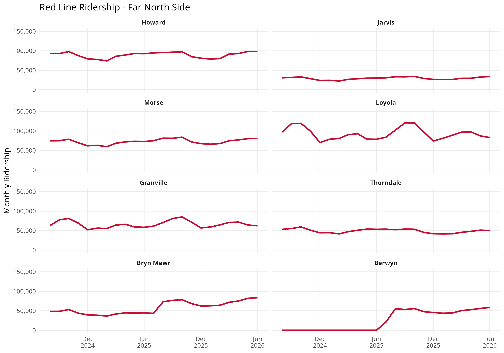
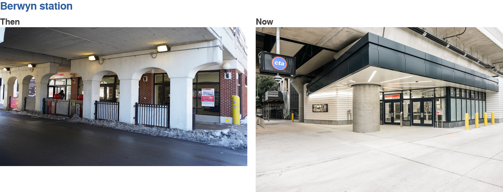
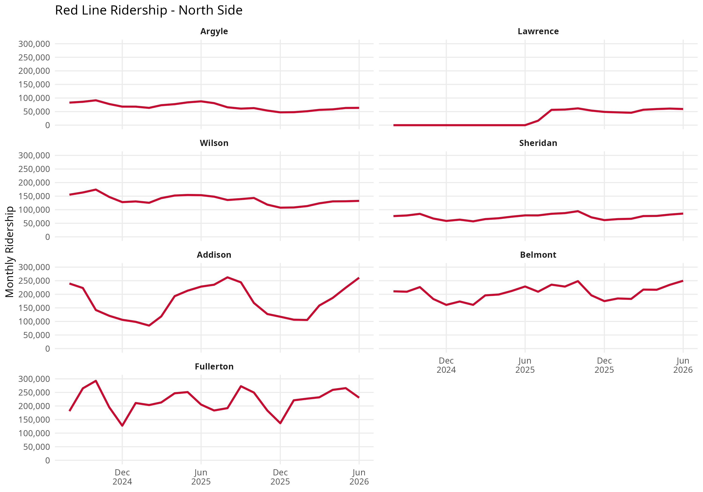
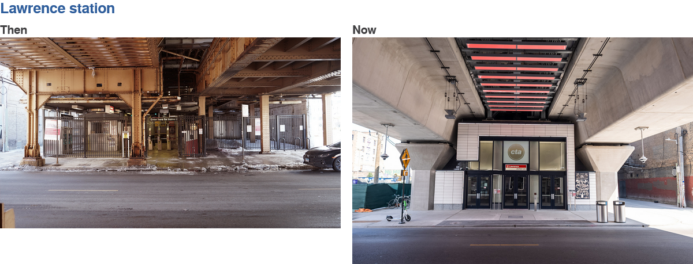
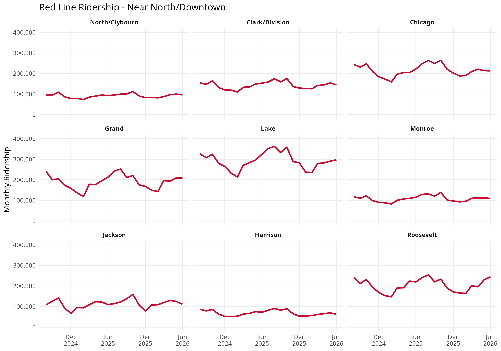
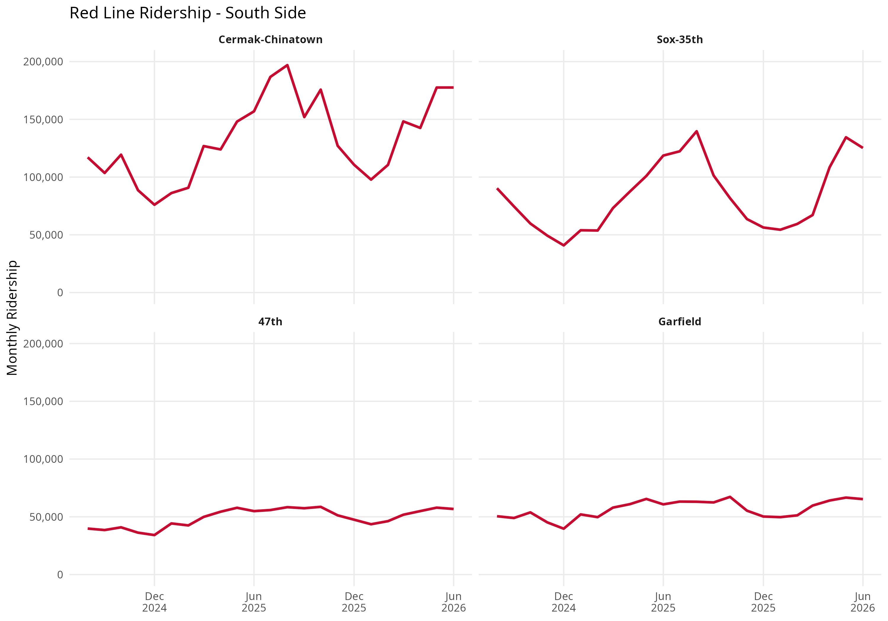
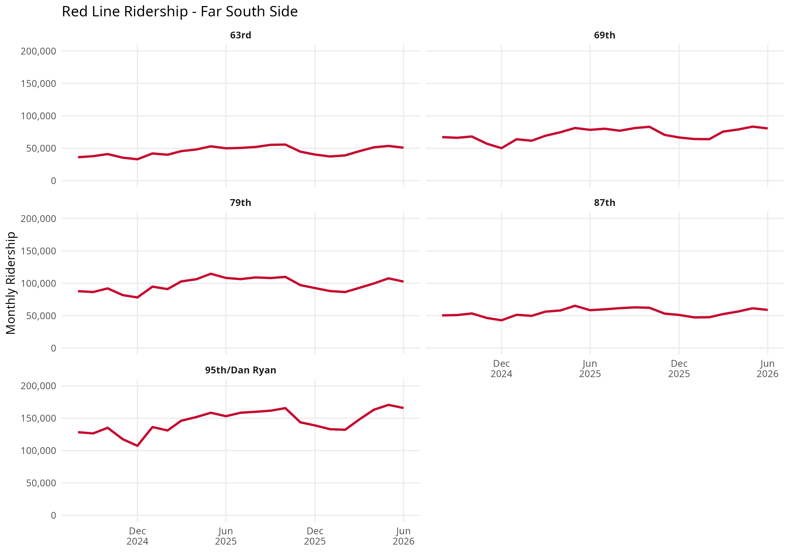

## Overview
How does ridership vary across CTA Red Line stations?

In this project, I used R to explore monthly CTA station ridership data, focusing specifically on the Red Line. I cleaned and organized the dataset, identified stations served by the Red Line, and created time-series visualizations to compare ridership patterns across stations.

Because the Red Line extends across a large portion of Chicago, displaying every station in a single visualization made the results difficult to interpret. I divided the stations into five geographic groups to make differences in ridership more visible:

- Far North Side
- North Side
- Near North / Downtown
- South Side
- Far South Side

## Tools
- R
- ggplot2
- dplyr
- tidyr
## Preparing the Data
I began by importing the CTA ridership dataset into R.

```{r}
library(ggplot2)
library(dplyr)
library(tidyr)

ctastations <- read.csv("CTA-ridership-routes.csv")
```

The monthly ridership totals were initially stored as text, so I converted them into numeric values. I also converted the month variable into a date format so that it could be used correctly in visualizations.

```{r}
ctastations <- ctastations %>%
  mutate(
    monthtotal = as.numeric(
      gsub(",", "", monthtotal)
    ),
    month_beginning = as.Date(
      month_beginning,
      format = "%m/%d/%Y"
    )
  )
```

## Filtering Red Line Stations
Some CTA stations serve more than one rail line. Because of this, I filtered for any station whose route information included the Red Line.

```{r}
redline <- ctastations %>%
  filter(grepl("Red", route))
```

This allowed transfer stations that serve the Red Line alongside other routes to remain part of the analysis.

## Ridership by Station
Initially, I plotted every Red Line station together. However, having a separate line for every station made the visualization difficult to read.

Instead, I grouped stations geographically and created small-multiple charts. Each panel represents one station and shows how its monthly ridership changed over time.

## Far North Side

The Far North Side group includes stations from Howard through Berwyn.



### Key Findings

- **Howard:** Howard has some of the highest ridership in this section, averaging approximately 89,000 monthly rides during the period analyzed. As the northern terminal of the Red Line, Howard also connects passengers with the Purple and Yellow lines and several bus routes. This allows the station to serve riders from the Far North Side as well as passengers traveling from areas farther north.

- **Jarvis:** Jarvis has the lowest ridership in the Far North Side group, averaging approximately 29,000 monthly rides. Unlike Howard, it primarily functions as a neighborhood station and does not serve as a major rail transfer point. Its location between Howard and Morse also means nearby residents have multiple Red Line stations available to them.

- **Morse:** Morse maintains substantially higher ridership than Jarvis and primarily serves the surrounding Rogers Park neighborhood. Its ridership is relatively consistent compared with stations affected by closures or major seasonal destinations.

- **Loyola:** Loyola is the busiest station in this section, averaging approximately 93,000 monthly rides. The station directly serves Loyola University's Lake Shore Campus, making it an important destination for students, faculty, staff, and visitors. Its ridership likely reflects both neighborhood travel and university-related demand.

- **Granville:** Granville maintains moderate ridership compared with neighboring Loyola and Thorndale. It primarily functions as a neighborhood station serving Edgewater rather than as a major transfer or destination station.

- **Thorndale:** Thorndale records lower ridership than nearby Loyola and Granville. Like Jarvis, it primarily serves the surrounding residential neighborhood and does not provide major rail connections. Its proximity to several other Red Line stations may also distribute local riders among multiple stations.

- **Bryn Mawr:** Bryn Mawr experiences a noticeable shift in ridership after July 2025. During the first half of the period analyzed, the temporary station provided southbound service only. The rebuilt Bryn Mawr station opened in July 2025, restoring service in both directions. Following the reopening, monthly ridership increased steadily and exceeded 80,000 rides by June 2026. The restoration of full service may help explain this increase.

- **Berwyn:** Berwyn records zero ridership until July 2025 before quickly returning to substantial monthly ridership. The station was closed from May 2021 through June 2025 for reconstruction, meaning the zero values represent a station closure rather than an absence of passenger demand.




## North Side

The North Side group includes stations from Argyle through Fullerton.



### Key Findings

- **Argyle:** Argyle maintains ridership throughout the period analyzed, although the station was affected by construction associated with the Red and Purple Modernization project. Unlike Lawrence, Berwyn, and Bryn Mawr, Argyle remained accessible to riders through a temporary station during construction. Changes in its ridership during this period should therefore be interpreted with the construction project in mind, but the station did not experience the same zero-ridership period seen at the fully closed stations.

- **Lawrence:** Lawrence records zero ridership through June 2025 before ridership appears in July. The station had been closed since 2021 for reconstruction, so its graph primarily captures the station's return to service rather than a normal multi-year ridership trend.



- **Wilson:** Wilson has comparatively strong ridership within this section. In addition to serving Uptown, Wilson is served by both Red and Purple Line trains during Purple Line Express operating periods, giving it a different role from nearby Red-only stations.

- **Sheridan:** Sheridan maintains moderate ridership but generally remains below Belmont and Fullerton. It primarily serves surrounding Lakeview neighborhoods and does not provide the same rail-transfer opportunities as the two major stations immediately to its south.

- **Addison:** Addison displays one of the clearest seasonal patterns on the Red Line. Ridership rises substantially during the warmer months, reaching approximately 262,000 rides in August 2025. The station directly serves Wrigley Field, and the timing of these increases overlaps with the Chicago Cubs baseball season. The station-level data alone cannot establish that Cubs games caused the increase, but Wrigley Field activity is a plausible contributor to the seasonal pattern.

- **Belmont:** Belmont is one of the busiest stations in the North Side group. However, it is served by the Red, Brown, and Purple lines, meaning its station-entry totals cannot be interpreted as Red Line ridership alone. Its role as a major transfer point and its location in a dense part of Lakeview likely contribute to its high usage.

- **Fullerton:** Fullerton also records some of the highest ridership in this section and, like Belmont, is served by the Red, Brown, and Purple lines. The station also serves Lincoln Park and is located near DePaul University's Lincoln Park Campus. Its high ridership may therefore reflect a combination of transfers, neighborhood activity, and university-related travel.


## Near North / Downtown

This group follows the Red Line from North/Clybourn through Roosevelt.



### Key Findings

- **North/Clybourn:** North/Clybourn has lower ridership than the busiest Downtown stations but serves an important commercial and residential area around North and Clybourn. Its ridership is relatively stable compared with stations associated with major seasonal destinations.

- **Clark/Division:** Clark/Division maintains relatively strong ridership and serves the Near North Side, including portions of the Gold Coast and Old Town. Unlike some Downtown stations, it does not directly connect with another CTA rail line, so its ridership is more closely associated with surrounding neighborhoods, businesses, destinations, and bus connections.

- **Chicago:** Chicago has consistently high ridership and serves one of the busiest portions of the Near North Side. Its location near Michigan Avenue, Water Tower Place, Northwestern University's downtown campus, hospitals, offices, retail, and tourist destinations provides several potential sources of passenger demand.

- **Grand:** Grand also maintains substantial ridership and serves the River North area. Its location near hotels, restaurants, nightlife, offices, and tourist destinations means its passenger base may include commuters, residents, and visitors rather than being dominated by a single type of trip.

- **Lake:** Lake has the highest average ridership in this section, averaging approximately 292,000 monthly rides. Its high ridership should be interpreted in the context of its central Downtown location and its role as a major transfer point. Lake connects Red Line riders with the nearby elevated State/Lake station, which historically served the Brown, Green, Orange, Pink, and Purple lines. The State/Lake station closed for reconstruction on January 5, 2026, which may affect transfer patterns toward the end of the period analyzed.

- **Monroe:** Monroe maintains substantial Downtown ridership but does not have the extensive rail-transfer connections available at Lake. Its location in the central Loop places it near major employment, retail, cultural, and tourist destinations, demonstrating how Downtown activity can generate high ridership even without direct transfers to another rail line.

- **Jackson:** Jackson is another important Downtown station and provides a pedestrian connection between the Red and Blue lines. Its ridership therefore may include passengers using the station as a transfer point in addition to passengers traveling to destinations within the surrounding Loop.

- **Harrison:** Harrison has the lowest average ridership in this section at approximately 69,000 monthly rides. This is particularly notable because it is located only a short distance from much busier Downtown stations. The difference demonstrates that being located in Downtown alone does not guarantee equally high station usage.

- **Roosevelt:** Roosevelt is one of the most important transfer stations south of the Loop. It is served by the Red, Green, and Orange lines and provides access to the South Loop and nearby destinations such as Museum Campus. Its station totals therefore reflect passengers using multiple CTA rail services rather than Red Line passengers alone.


## South Side

The South Side group includes stations from Cermak-Chinatown through Garfield.



### Key Findings

- **Cermak-Chinatown:** Cermak-Chinatown has the highest ridership among the stations in this group, averaging approximately 132,000 monthly rides. The station serves Chinatown and the surrounding Near South Side, giving it access to a major residential, commercial, dining, and visitor destination. Its location immediately south of Downtown may also contribute to its comparatively high usage.

- **Sox-35th:** Sox-35th has the second-highest average ridership in this section at approximately 83,000 monthly rides and shows noticeable seasonal variation. The station directly serves Rate Field, home of the Chicago White Sox. Increased activity during baseball season may therefore contribute to warmer-month ridership, although the monthly station data alone cannot establish causation.

- **47th:** 47th has substantially lower ridership than Cermak-Chinatown and Sox-35th. It primarily functions as a neighborhood and bus-connection station rather than serving a major regional destination, which may partly explain the difference.

- **Garfield:** Garfield maintains moderate ridership and serves as an important connection between the Red Line and east-west bus service. Its role is primarily that of a neighborhood transportation connection rather than a major entertainment or Downtown destination.

Overall, combined monthly ridership across these South Side stations increased from approximately 298,000 in August 2024 to 425,000 in June 2026, an increase of roughly 43%.


## Far South Side

The Far South Side group includes stations from 63rd through 95th/Dan Ryan.



### Key Findings

- **63rd:** 63rd records the lowest ridership among the Far South Side stations. It primarily serves surrounding neighborhoods and connecting bus passengers and does not have the terminal function or extensive regional bus connections found at 95th/Dan Ryan.

- **69th:** 69th averages approximately 71,000 monthly rides and maintains higher ridership than 63rd. Its location along a major east-west corridor and connections with CTA bus service allow it to serve riders traveling from neighborhoods beyond the immediate station area.

- **79th:** 79th is the second-busiest station in this section, averaging approximately 98,000 monthly rides. 79th Street is a major east-west transportation corridor, and bus connections allow the station to draw riders from communities located east and west of the Dan Ryan Expressway.

- **87th:** 87th maintains substantial ridership but remains below 79th and 95th/Dan Ryan. Like the other intermediate Dan Ryan stations, it serves as an important connection between east-west bus routes and north-south Red Line service.

- **95th/Dan Ryan:** 95th/Dan Ryan is the busiest station in the Far South Side group, averaging approximately 145,000 monthly rides. Its importance extends beyond the immediate neighborhood because it is the southern terminal of the Red Line and a major bus terminal. CTA and Pace routes connect the station with Far South Side neighborhoods and nearby south suburban communities, allowing passengers from areas without direct rail service to transfer to the Red Line. Its high ridership therefore reflects its role as a regional transportation gateway as well as a neighborhood station.

Combined monthly ridership across the Far South Side stations increased from approximately 370,000 in August 2024 to 459,000 in June 2026, an increase of roughly 24%. All five stations recorded higher ridership in June 2026 than in August 2024.


## Overall Findings

Several broader patterns emerge when Red Line ridership is examined geographically.

First, **stations appear to play different roles within the Red Line network**. Some stations primarily serve surrounding neighborhoods, while others function as major destinations, transfer hubs, or regional gateways. These differences help explain why stations located relatively close to one another can have substantially different ridership levels.

**Major destinations appear to be associated with distinctive ridership patterns.** Loyola directly serves Loyola University, Addison serves Wrigley Field, and Sox-35th serves Rate Field. Addison and Sox-35th also show seasonal patterns that correspond with baseball season, while Loyola maintains relatively high ridership near a major university.

**Transfer stations are among some of the highest-ridership stations on the line.** Howard connects the Red Line with the Purple and Yellow lines, Belmont and Fullerton connect with the Brown and Purple lines, Lake provides connections with several elevated lines, Jackson connects with the Blue Line, and Roosevelt is served by the Red, Green, and Orange lines. Station entries at these locations therefore reflect their role within the broader CTA rail network rather than Red Line usage alone.

**The terminal stations function as regional transportation gateways.** Howard serves as a connection point for riders traveling between Chicago's Far North Side and areas farther north, while 95th/Dan Ryan connects the Red Line with numerous bus routes serving the Far South Side and nearby suburbs. Their ridership demonstrates how the geographic reach of a CTA station can extend well beyond the neighborhood immediately surrounding it.

**High ridership and ridership growth are not necessarily the same thing.** North Side and Downtown stations include many of the highest-ridership stations in the dataset, while the South Side and Far South Side groups experienced substantial increases during the period analyzed.

Finally, **station construction and service changes create patterns that require additional context.** Berwyn and Lawrence were closed for reconstruction during part of the period analyzed, resulting in periods of zero ridership before reopening in 2025. Bryn Mawr and Argyle remained in service through temporary stations, although construction affected how those stations operated. In particular, Bryn Mawr provided southbound service only until the rebuilt station opened in July 2025. These differences demonstrate why changes in station ridership should be interpreted alongside changes in station availability and service.

Together, these patterns suggest that Red Line station ridership is shaped by a combination of station function, transportation connections, nearby destinations, geography, and changes to the transit system itself.


## Data Limitations

These findings describe **station entries**, not the exact number of passengers riding Red Line trains.

Several Red Line stations are served by multiple CTA rail lines. At these transfer stations, the dataset records station ridership but does not identify which rail line each passenger ultimately used. Therefore, the analysis should be interpreted as ridership at **stations served by the Red Line**, rather than exact Red Line train ridership.

The dataset also does not identify passengers' origins, destinations, reasons for traveling, or how they reached a station. For example, the data cannot determine how many passengers entering Loyola were traveling to the university, how many Addison riders were attending Cubs games, or how many passengers at 95th/Dan Ryan arrived using connecting bus service.

Monthly station totals can also be influenced by factors that are not directly represented in the dataset, including the number of days in each month, construction, station closures, service disruptions, weather, special events, and changes in connecting transit service.

For these reasons, nearby universities, sporting venues, transfer opportunities, and bus connections provide useful context for interpreting the graphs but should not be treated as proof that they caused the observed ridership patterns. Additional data would be necessary to establish those relationships.